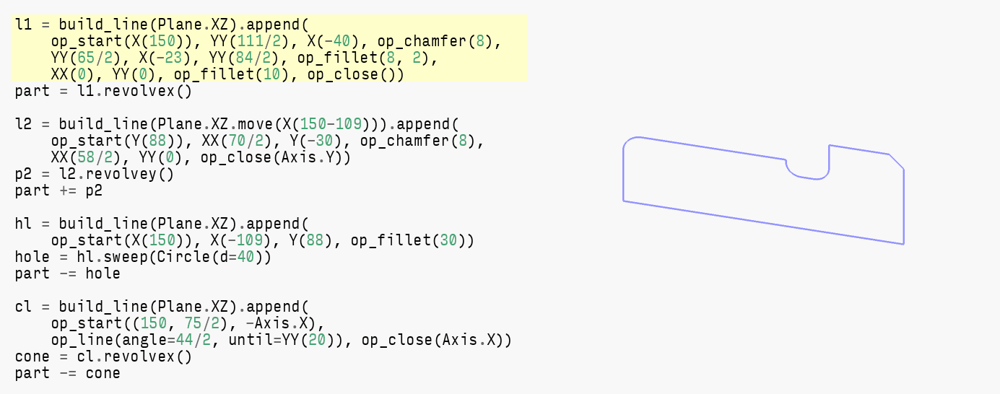

`build123d_draft` is a collection of utilities/helpers for an amazing CAD
[Build123d][build123d]. Build123d did a great work for hiding OCCT complexity
behind nice pythonic interface. Though my experience with the library revealed
some repetitive patterns. `build123d_draft` is an attempt to abstract these
patterns.

Project in a WIP state. API is highly experimental and main goal of the repo is to
show `Build123d` viability for concise and expressive modelling via code.

* `build_line`: provides shortcuts to aid wire construction in a specified plane.
  Easy filleting, trimming, close by axis, close and mirror by axis. Single
  arc for all cases. Lines are specified by single point.
* `make_slot`/`make_hslot`: combines functionality of `*Slot*` sketches. Adds
  explicit origin point, center point, ability to extrude and has object
  properties for natural center locations. Radius support.
* `RX`, `RY`, `RZ`: rotations for corresponding axis.
* `R.X`, `R.Y`, `R.Z`: constant rotation to a corresponding axis.
* `X`, `Y`, `Z`: Relative positions for a single coordinate.
* Gravity based align: `Align.sw` — part location would be in south-west
  corner.
* Custom `Cylinder`/`Circle` with ability to create a similar shape in the same
  location. Diameter support.
* PNG renderer using OCCT offscreen visualizer.

Huge thanks to [Too Tall Toby][ttt]. All example models are TTT's work.
If you want to try CADing it's the best place to start. It could be a
fun casual hobby same as solving sudoku :P

Note: you could notice all examples are kinda dirty, with repeating inline dimensions.
I've tried to speed-model all parts: writing code simulteniosly with workiing out
draft details. It's a no brainer to extract dimensions into variables with nice
names and make models fully parametric.

[build123d]: https://github.com/gumyr/build123d
[ttt]: https://tootalltoby.com/

Documentation:

* [`build_line` tutorial](./tutorial.md)

Here are examples showcasing `build123d_draft` in action:
