`build123d_draft` is a collection of utilities/helpers for an amazing CAD
[Build123d][build123d]. Build123d did a great work for hiding OCCT complexity
behind nice pythonic interface. Though my experience with the library revealed
some repetitive patterns. `build123d_draft` is an attempt to abstract these
patterns.

Project in a WIP state. API is highly experimental and main goal of the repo is to
show `Build123d` viability for concise and expressive modelling via code.

* `build_line`: provides shortcuts to aid wire construction in a specified plane.
  Easy filleting, trimming, close by axis, close and mirror by axis. Single
  arc for all cases. Lines are specified by single point.
* `make_slot`/`make_hslot`: combines functionality of `*Slot*` sketches. Adds
  explicit origin point, center point, ability to extrude and has object
  properties for natural center locations. Radius support.
* `RX`, `RY`, `RZ`: rotations for corresponding axis.
* `R.X`, `R.Y`, `R.Z`: constant rotation to a corresponding axis.
* `X`, `Y`, `Z`: Relative positions for a single coordinate.
* Gravity based align: `Align.sw` — part location would be in south-west
  corner.
* Custom `Cylinder`/`Circle` with ability to create a similar shape in the same
  location. Diameter support.
* PNG renderer using OCCT offscreen visualizer.

Huge thanks to [Too Tall Toby][ttt]. All example models are TTT's work.
If you want to try CADing it's the best place to start. It could be a
fun casual hobby same as solving sudoku :P

Note: you could notice all examples are kinda dirty, with repeating inline dimensions.
I've tried to speed-model all parts: writing code simulteniosly with workiing out
draft details. It's a no brainer to extract dimensions into variables with nice
names and make models fully parametric.

[build123d]: https://github.com/gumyr/build123d
[ttt]: https://tootalltoby.com/

Here are examples showcasing `build123d_draft` in action.


* [TTT Challenges](#test_ttt_monthly_challenge)
* [TTT Practice](#test_ttt_practice)
* [TTT Build123d tutorials](#test_build123d_tutorials)


<a name="test_ttt_monthly_challenge"></a>

## TTT Challenges

A selection of models from [TTT Challenges][ttt-challenges].
It's a monthly competition with available drafts and final
part mass. It's an easiest way to train your skills.

[ttt-challenges]: https://www.tootalltoby.com/Leaderboard/


### test_24_04_LB1_u_joint_fork

Source:https://www.tootalltoby.com/challenge/2024-04/drawings/  
Draft: https://www.tootalltoby.com/media/challenges/events/models/D_LEADERBOARD_CHALLENGE_MODEL_1_IMAGE_-_APRIL.png


```python
l1 = build_line(Plane.XZ).append(
    X(42/2), Y(51), op_fillet(12),
    X(14), YY(-14), XX(0), op_fillet(26),
    op_close(),
)
part = l1.extrude(38/2+1, both=True) # +1 to give space for fillet

l2 = build_line(Plane.YZ).append(
    op_arc(15, 17/2-90, start=Y(51)),
    op_line(until=XX(38/2)), YY(0), op_fillet(115),
    X(5), op_close(Axis.X.offset(Y=60))
)
part -= mirror_add(l2.extrude(100))

loc = Pos(X=70/2, Z=51-15) * R.X
part += loc * Cylinder(70/2-36/2, r=15, align=A.u)
part -= loc * CounterSinkHole(13/2, 19/2, 50, 100)
part = mirror_add(part, Plane.YZ)

b = 51 - 15 - 65
c = Z(b) * Cylinder(abs(-5 - b), d=32, align=A.d)
part, edges = new_edges_add(c, part)
part = fillet(edges, 3)
part -= mirror_add(Y(-38/2) * Box(100, 5, 14, align=A.nu))

part -= c.new(50, d=21)


```


### test_22_T_32_pivot_plate

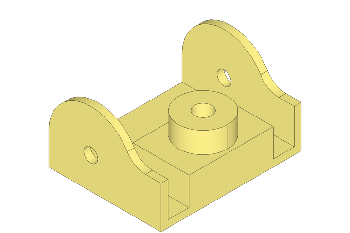

```python
l = build_line(Plane.XZ).append(
    Y(2.625-1.5), op_arc(1.5, -180, name='a'),
    op_trim(Axis.X.offset(4, 1.5), add=True),
    op_fillet(0.75),
    op_close(Axis.X)
)
p1 = l.extrude(-0.25)
p1 -= Pos(l.a.arc_center) * R.Y * Cylinder(1, d=0.5)
p1 = mirror_add(Y(-5/2) * p1)

part = p1 + Box(4, 5, 0.25, align=A.wd)
part += X(4) * Box(2, 3, 1.25, align=A.ed)

c = X(3) * Cylinder(2, d=1.75, align=A.d)
part = part + c - c.new(d=0.625)


```


### test_24_05_LB1_clamp_bracket

Source: https://www.tootalltoby.com/challenge/2024-05/drawings/


```python
l1 = build_line((-133/2, 12)).append(
    op_line(angle=19, tangent=(1, 0), until=XX(0)),  # TODO: make axis as tangent
    op_line(angle=-19, tangent=(1, 0), until=XX(133/2)),
    op_fillet(33), op_close(mirror=Axis.X)
)
p1 = l1.extrude(20)
p1 -= mirror_add(Pos(99/2, Z=20) * cbore(12, 5, 6, 20), Plane.YZ)

l2 = build_line(Y(33)).append(
    op_arc(33, -180),
    op_trim(Axis.Y.offset(44/2, -55-15), add=True, idx=0), # TODO: select nearest point
    op_fillet(30), op_close(mirror=Axis.Y)
)
p2 = l2.extrude(41)

edges = p2.edges().filter_by(Axis.X).group_by(
    Axis.Z)[-1].group_by(Axis.Y)[0]
p2 = fillet(edges, 15)
p2 -= Pos(44/2, -55, 26) * R.X * cbore(12, 5, 6, 44)

part = p1 + p2
part -= Cylinder(41, d=42, align=A.d)
part -= Box(8, 55+15, 41, align=A.nd)


```


### test_24_05_LB2_chamber

Source: https://www.tootalltoby.com/challenge/2024-05/drawings/

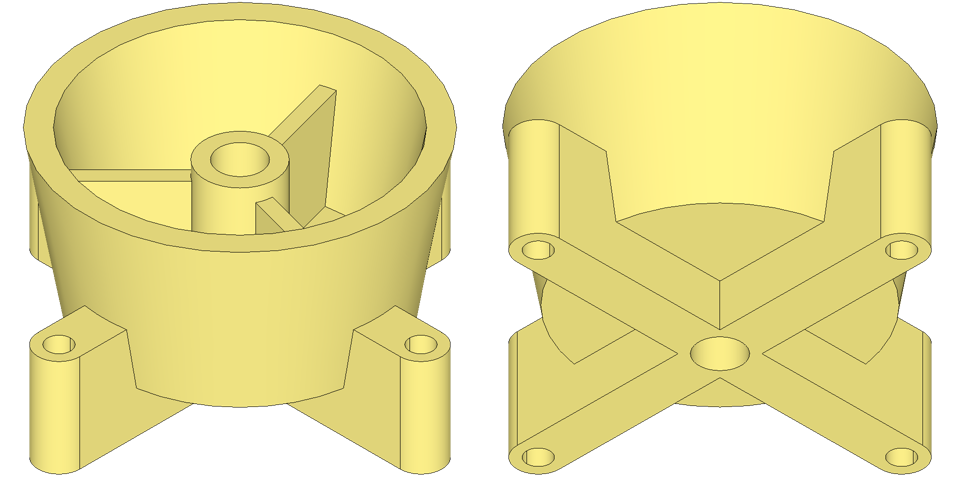

```python
l = build_line((5.5/2, 3.5), Plane.XZ, Y(-1)).append(
    op_line(angle=-10, until=YY(0.75)), XX(0)
)
sk = offset(l.wire(), 0.375, side=Side.RIGHT)

l.append(op_close(Axis.Y))
bowl = l.revolvez()

p1 = revolve(split(make_face(sk.edges()), Plane.XY.offset(3.5),
                   keep=Keep.BOTTOM))

sl = make_slot(6.5, h=1.75, r=0.375)
p2 = sl - sl.center_locs * Cylinder(1.75, d=.41, align=A.u)

part = p1 + (RZ(45) * p2 + RZ(90+45) * p2 - bowl)

loch = Z(0.75)
rib = loch * Box(5.5/2, 0.25, 3.5-0.75*2, align=A.wd)
part += bowl & PolarLocations(0, 3, 60) * rib

part += loch * Cylinder(3.5-0.5-0.75, d=1.25, align=A.d)
part -= Cylinder(3.5-0.5, d=0.75, align=A.d)


```


### test_24_05_LB3_arm_housing

Source: https://www.tootalltoby.com/challenge/2024-05/drawings/  
Draft: https://www.tootalltoby.com/media/challenges/events/models/F_LEADERBOARD_CHALLENGE_MODEL_3_IMAGE_-_MAY.png

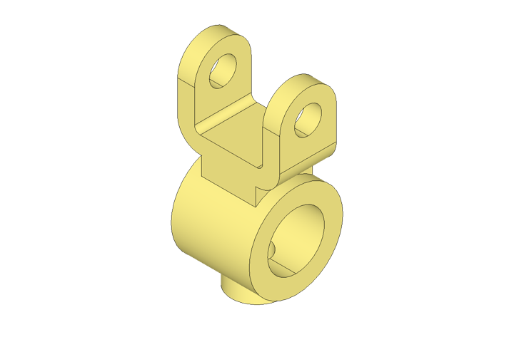

```python
l = build_line(Plane.XZ).append(
    X(38/2), Y(51-12), XX(72/2), YY(78+20), op_fillet(16),
    X(-12), YY(51), XX(0), op_fillet(4), op_close()
)
p1 = l.extrude(20, both=True)

# TODO: transform slot center locations
sl = X(72/2) * -R.X * make_slot(78*2, h=12, d=40)
p1 = split(p1, Plane.YZ.offset(72/2-12), keep=Keep.BOTTOM) + (p1 & sl)
p1 -= Pos(72/2, Z=78) * R.X * Cylinder(24, d=19)
p1 = mirror_add(p1, Plane.YZ)

c1 = R.X * Cylinder(55, d=66)
c2 = Cylinder(40, d=36, align=A.u)
part = p1 + c1 + c2 - c2.new(d=18) - c1.new(d=40)


```


### test_24_07_LB3_adj_base

Source: TTT: https://www.tootalltoby.com/challenge/2024-07/drawings/  
Draft: https://www.tootalltoby.com/media/challenges/events/models/F_LEADERBOARD_CHALLENGE_MODEL_3_IMAGE_-_JULY.png

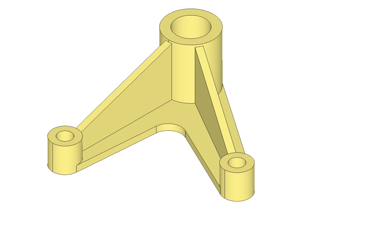

```python
c1 = X(127) * Circle(d=25)
c2 = Circle(d=45)
c3 = Pos(Vector(1, 0).rot(60) * 127) * Circle(d=25)

base_sk = make_hull((c1 + c2).edges()) + make_hull((c2 + c3).edges())
base_sk = fillet(base_sk.vertices().group_by(Axis.X)[2], 13)
base = extrude(base_sk, 6)
base.clean()

cl1 = c1.cylinder(25)
cl2 = c2.cylinder(57)
cl3 = c3.cylinder(25)

rl = build_line((c2.radius, 55), Plane.XZ).append(
    (127-c3.radius, 23),
    op_extend(start=YY(56), end=XX(127)),
    op_close(Axis.X)
)
rib = rl.extrude(3, both=True)

cset = cl1 + cl2 + cl3
part = base - cset + cset + rib + RZ(60) * rib
part -= cl1.new(d=13) + cl2.new(d=29) + cl3.new(d=13)


```


### test_24_07_LB1_foot_holder

Source: TTT: https://www.tootalltoby.com/challenge/2024-07/drawings/  
Draft: https://www.tootalltoby.com/media/challenges/events/models/D_LEADERBOARD_CHALLENGE_MODEL_1_IMAGE_-_JULY.png

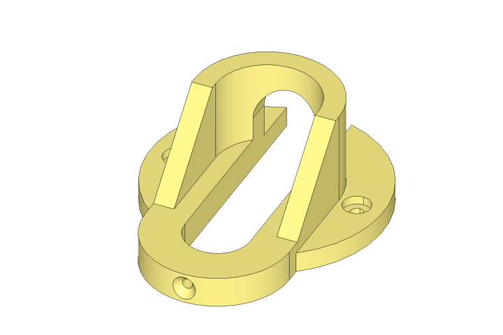

```python
c = Cylinder(12, d=136, align=A.d)
c -= mirror_add(Pos(Y=105/2, Z=12) * cbore_d(16, 5, 8, 12))

loc = X(-62/2)
part = c + loc * make_slot(62, h=66, r=42)
part -= Z(18) * loc * make_slot(62, h=66-18, r=42-12)

l = build_line(Plane.XZ).append(
    op_line(start=Pos(-52, 18), angle=45, until=YY(66)),
    op_close(Plane.YZ.offset(-200))
)
part -= l.extrude(100, both=True)
part -= make_slot(62*2, h=18, r=19)
part -= Box(100, 19*2, 18, align=A.wd)
part -= R.X * make_slot(32*2, h=50, r=19)
part -= Pos(X=-62-42, Z=9) * -R.X * CounterSinkHole(6/2, 14/2, 50, 82)


```


### test_24_04_LB2_rod_end_mount

Source:https://www.tootalltoby.com/challenge/2024-04/drawings/  
Draft: https://www.tootalltoby.com/media/challenges/events/models/E_LEADERBOARD_CHALLENGE_MODEL_2_IMAGE-APRIL.png

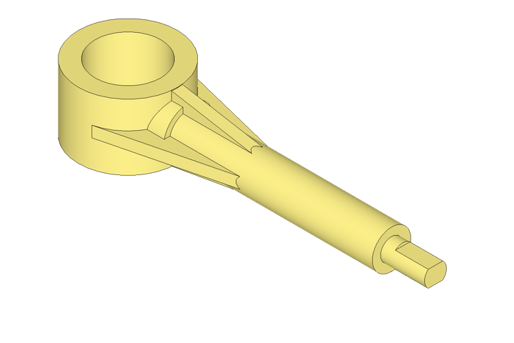

```python

c = R.X * Cylinder(1.375, d=1.125, align=A.d)
part = c + c.new(7-1, d=0.875) + c.new(7, d=0.5)
cut = X(7) * Z(0.375/2) * Box(.75, 1, 1, align=A.de)
part -= mirror_add(cut, Plane.XY)

r = 2.25/2
l1 = build_line(Pos(r, 1.5/2-0.01), Plane.XZ).append(
    op_line(angle=-10, until=YY(0)),
    op_extend(start=YY(1.5/2-0.001)),
    op_close(mirror=Axis.X),
)
part += l1.extrude(.25/2, both=True)

l2 = build_line().append(
    op_arc(r, -14, start=Y(r)),
    op_line(until=YY(0)),
    op_drop(),
    op_close(mirror=Axis.X),
)
part += l2.extrude(.25/2, both=True)

c = Cylinder(1.5, r=r)
part = part + c - c.new(d=1.5)


```


### test_24_04_LB3_end_base

Source:https://www.tootalltoby.com/challenge/2024-04/drawings/  
Draft: https://www.tootalltoby.com/media/challenges/events/models/F_LEADERBOARD_CHALLENGE_MODEL_3_IMAGE_-_APRIL_SS11zYc.png

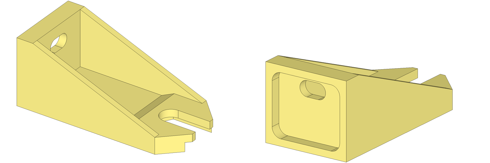

```python

l = build_line(Pos(218, 22), Plane.XZ).append(
    XX(175-25),
    op_line(angle=25, until=YY(14)),
    XX(22), YY(88), XX(0),
    op_close(Axis.X)
)
part = l.extrude(-50)
part = split(part, Plane.XZ.move(Pos(188, 50)).rotated((0, 0, -45)))

l = build_line(plane=Plane.XZ.offset(-50)).append(
    op_line(start=(22, 88), to=(188, 22)),
    op_close(Axis.X)
)
part += l.extrude(8)
part = mirror_add(part)

part -= Z(88/2) * R.X * extrude(
    RectangleRounded(88-16, 100-16, 11), 22-10)
part -= Z(88-24) * R.X * make_slot(14, h=30, r=9, rotation=90)

l = build_line(X(175-30)).append(
    op_line(angle=60, until=YY(52/2)),
    op_close(Axis.Y.offset(X=230))
)
part -= mirror_add(l.extrude(12))
part -= X(218) * make_slot((218-175)*2, h=30, d=28)


```


### test_2024_03_10_offset_support

Source: https://www.tootalltoby.com/leaderboard/2024-03/  
Draft: https://www.tootalltoby.com/static/images/2024-03_LEADERBOARD_CHALLENGE_MODEL_1_IMAGE.png

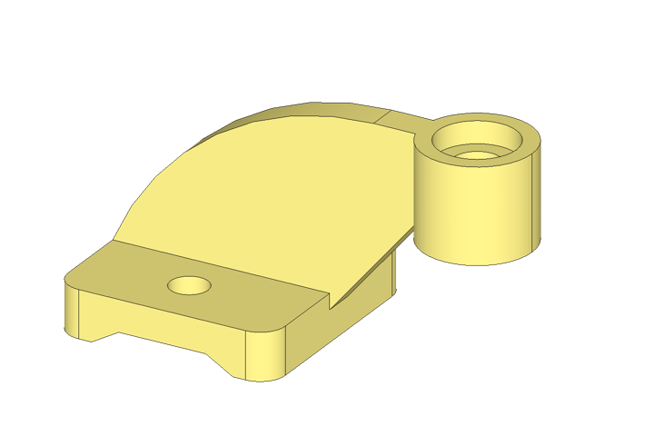

```python
l = build_line(Plane.XZ).append(
    op_line(start=(69, 10), angle=50, until=XX(80+33)), YY(70),
    op_arc(90, 90, start=(0, 70), tangent=(-1, 0)),
    op_trim(Axis.X.offset(Y=15)),
    op_move(end=(0, 15), connect=True),
    op_close(Axis.X)
)
part = l.extrude(5, both=True)

c = Pos(80+33, 0, 70) * Cylinder(30, d=35, align=A.u)
part = part + c - c.location * cbore_d(25, 7, 15, 30)

part += extrude(RectangleRounded(69, 75, 8, align=A.w), 15)
part -= mirror_add(Pos(33, 40/2) * Cylinder(15, d=12, align=A.d))

lc = build_line(Plane.XZ).append(
    op_line(start=XX(12), angle=30, until=Y(5)),
    op_close(mirror=Axis.Y.offset(69/2)),
)
part -= lc.extrude(100, both=True)


```


### test_2024_03_12_side_spacer

Source: https://www.tootalltoby.com/leaderboard/2024-03/  
Draft: https://www.tootalltoby.com/static/images/2024-03_LEADERBOARD_CHALLENGE_MODEL_3_IMAGE.png


```python

l = build_line().append(
    op_arc(50, 90, start=X(60+50), tangent=(0, 1)),
    op_trim(Axis.X.offset(Y=40)),
    op_line(tangent=(1, 0), angle=15, until=XX(60+196)),
    op_drop(), op_close(mirror=Axis.X)
)
part = l.extrude(20)

c = X(60+196) * Cylinder(35, r=95, align=A.d)
part = part + c - c.new(r=75)
part = split(part, Plane.YZ.offset(c.location.position.X),
             keep=Keep.BOTTOM)

s1 = make_hslot((-40, 60), h=40, r=50, both=True)
s2 = -R.Y * make_hslot((60+50, 0), h=50, r=40, both=True)
part = part + Z(40) * (s1 & s2)

part -= Pos(60) * Cylinder(80, d=42, align=A.d)
part -= mirror_add(Pos(0, -50, 40) * -R.Y * CounterSinkHole(
    33/2, 33/2+8, 50, 90))

l = build_line(Plane.XZ).append(
    op_line(start=Pos(60+50, 80-20), angle=-30, until=XX(60+196-95)),
    op_extend(5, 5), op_close(Axis.X)
)
part += l.extrude(6, both=True)


```


<a name="test_ttt_practice"></a>

## TTT Practice

[TTT practice][ttt-practice] is nice game mode for CADing.

Models here are augmented for spoil-free results.

[ttt-practice]: https://www.tootalltoby.com/practice/


### test_corner_cap

Source: https://www.tootalltoby.com/practice/a441dcaa-0d1c-42f0-b037-73786e93a9ea

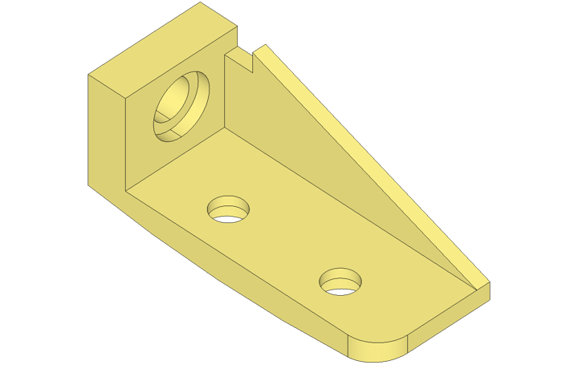

```python
l = build_line(Plane.XZ).append(
    YY(55), X(20), YY(9), XX(155), Y(-9),
    op_arc(560, to=(0, 0), tangent=False)
)
part = l.extrude(-60)

edges = part.edges().filter_by(Axis.Z).group_by(Axis.X)[-1].group_by(Axis.Y)[0]
part = fillet(edges, 16)

part -= Pos(20, 30, 55-22) * R.X * cbore_d(30, 6, 20, 20)

h = cbore_d(16, 5, 24, 18)
part -= Pos(155-40, 20, 9) * h
part -= Pos(155-40-60, 20, 9) * h

rl = build_line(Plane.XZ.offset(-60)).append(
    YY(55-10), X(20+15), Y(10), (155, 9), op_close()
)
part += rl.extrude(7)


```


### test_lstop_simple

Source: https://www.tootalltoby.com/practice/6926892f-c1e3-4d84-8ed8-359eb98d51b8

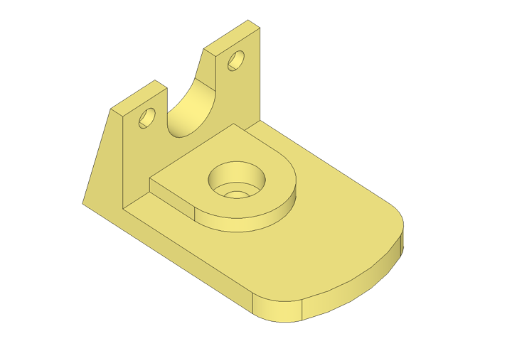

```python
l = build_line((130, 0), tangent=(0, 1)).append(
    op_arc(77, 45, name='a'), op_trim(Axis.X.offset(25, 85/2), add=True),
    op_fillet(20), op_close(mirror=Axis.X)
)
part = l.extrude(12)

s = make_hslot(start=25, center=l.a.arc_center, r=26, h=12+8)
part = part + s - s.center_locs * cbore_d(25, 12, 13, 30)

lr = build_line(Plane.XZ).append(
    op_line(angle=90-15, until=YY(65)), op_close(XX(25))
)
rib = lr.extrude(85/2, both=True)

h = Pos(25, 55/2, 65-10) * R.X * cbore_d(10, 5, 5, 30)
rib -= mirror_add(h)
rib -= Z(65) * R.X * make_hslot(center=20, r=15, h=30)
part += rib


```


<a name="test_build123d_tutorials"></a>

## TTT Build123d tutorials

This is a reimplementation of [Too Tall Toby tutorials][tttt] documenation
section using `build_line` as a main draft tool.

[tttt]: https://build123d.readthedocs.io/en/latest/tttt.html


### test_ppack_01_01

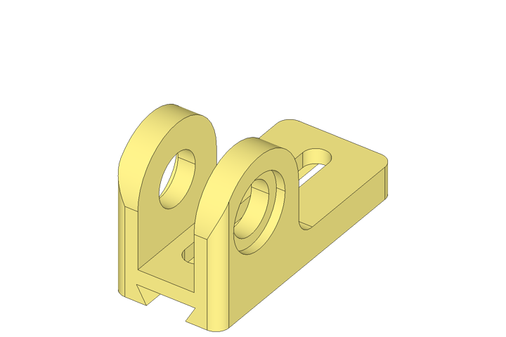

```python
l = build_line(Plane.XZ.offset(25)).append(
    Y(42),
    op_arc(26, -180, name='a'),
    YY(15),
    X(30),
    op_fillet(9),
    op_close(Axis.X),
)

hole = cbore_d(34, 4, 24, 12)
part = mirror_add(l.extrude(-12) - Pos(l.a.arc_center) * -R.Y * hole)

part += Box(115, 50, 15, align=A.dw)
part -= X(115-10) * make_slot(90, h=15, center=False, d=12, align=A.e)

tl = build_line(X(9), Plane.YZ).append(
    op_line(angle=60, until=Y(8)), op_close(mirror=Axis.Y)
)
part -= tl.extrude(115)

part &= extrude(RectangleRounded(115, 50, 6, align=A.w), 100)

```


### test_ppack_01_02

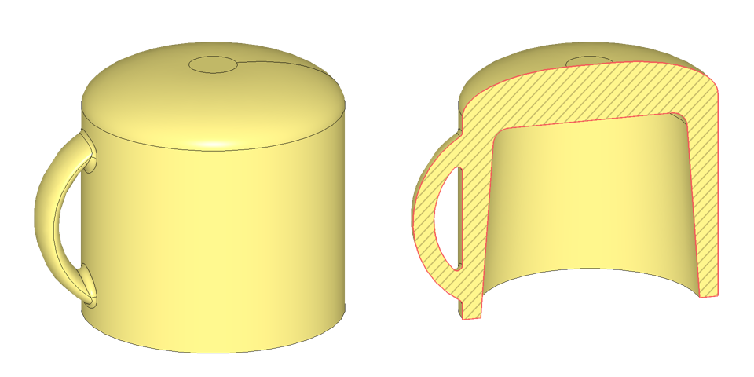

```python
l = build_line(X(49/2), Plane.XZ).append(
    Y(40),
    op_ellipse_arc(20, 8, 0, 90),
    op_close(Axis.Y)
)
base = l.revolvez()

hl = build_line(Plane.XZ).append(
    op_arc(17, 180, center=(-15, 20), start_angle=90))
handle = hl.sweep(Ellipse(2, 5))

part, edges = new_edges_add(handle, base)
part = fillet(edges, 1)

il = build_line(X(42/2), Plane.XZ).append(
    op_line(angle=94, until=Y(37)),
    XX(0),
    op_fillet(3),
    op_close(Axis.Y)
)
part -= il.revolvez()


```


### test_ppack_01_03


```python
l = build_line(Plane.XZ).append(
    Y(-34), X(95), Y(34), op_fillet(18, 2),
    X(-18), Y(16-34), XX(14), YY(0), op_fillet(7, 2), op_close()
)
part = l.extrude(8, both=True)

loc1 = X(14-23) * -R.X
part += loc1 * Cylinder(23, r=8, align=A.u)
part -= loc1 * CounterSinkHole(5.5/2, 11.2/2, 23, 90)

c2 = X(95-18) * -R.X * Cylinder(18, r=8, align=A.u)
part = part + c2 - c2.new(d=5.5)


```


### test_ppack_01_04

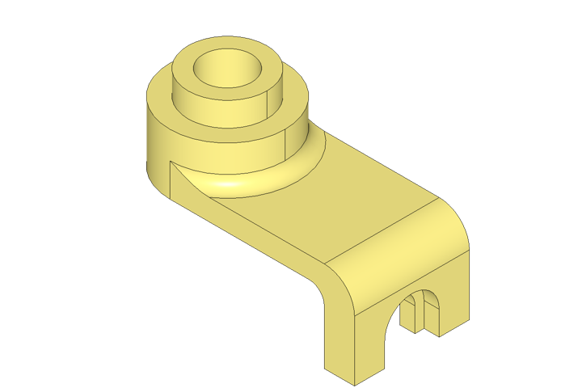

```python
l = build_line(Plane.XZ).append(
    X(80-38/2-10), Y(7-30), op_fillet(5),
    X(10), Y(30), XX(0), op_fillet(10), op_close()
)
base = l.extrude(30, both=True)

c1 = Cylinder(7+21-8, d=38, align=A.d)

part, edges = new_edges_add(c1, base)
part = fillet(edges.filter_by(Plane.XY), 4)
part &= X(-38/2) * Box(80+38, 38, 100, align=A.w)

c2 = Pos(Z=21+7) * Cylinder(8, d=26, align=A.u)
part = part + c2 - c2.new(21+7, d=16)

sloc = Pos(80-38/2, Z=7-30) * R.X
part -= sloc * make_slot((17-9)*2, h=-5, r=9)
part -= sloc * make_slot((17-9)*2, h=-10, r=6)


```


### test_ppack_01_06

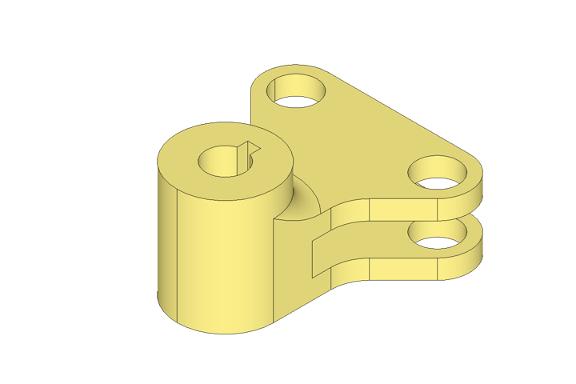

```python
l = build_line((44/2, 69-15)).append(
    op_arc(10, -45-90, name='a'),
    op_line(until=XX(15)), YY(0), op_fillet(12),
    op_close(Axis.Y)
)

base = l.extrude(22) - Pos(l.a.arc_center) * Cylinder(22, d=13, align=A.d)
base = mirror_add(base, Plane.YZ)

c = RZ(-90) * Cylinder(36, d=30, align=A.d)
part, edges = new_edges_add(c, Box(50, 30, 22, align=A.sd))
part = fillet(edges.filter_by(Plane.XY), 6)
part = base + (part & Box(30, 60, 100, align=A.d))

part -= Cylinder(36, d=12, align=A.d)
part -= Box(4, 9, 36, align=A.sd)
part -= Pos(Y=69-15, Z=6+5) * Box(44+10*2, 42, 10, align=A.n)


```


### test_ppack_01_09


```python
cl = build_line(Plane.XZ).append(
    op_line(angle=-45, until=YY(-45)),
    op_line(6, 90), op_line(angle=90, until=XX(0), name='l'),
)

p1 = split(make_slot(cl.l.length*2, h=-6, center=False, d=75),
           Plane.YZ.offset(-1))
p1 -= X(cl.l.length-75/2) * Cylinder(12, d=33)
p1 = cl.normal_loc(tangent=-1) * p1

l2 = build_line(Y(60), Plane.YZ).append(
    op_arc(15, 75/2-90), op_line(until=XX(75/2)),
    YY(0), op_close(Axis.Y)
)
p2 = mirror_add(l2.extrude(-13))
p2 -= Pos(l2[0].arc_center) * R.X * Cylinder(26, d=12)

l3 = build_line().append(
    Y(-75/2), X(-69), Y(75), XX(0),
    op_fillet(17, 2), op_close()
)
p3 = l3.extrude(13)
p3 -= mirror_add(Pos(17-69, 75/2-17, 13) * cbore_d(15, 4, 8, 13))

part, edges = new_edges_add(p2+p3, p1)
part = fillet(edges, 16)


```


### test_23_T_24_curved_support

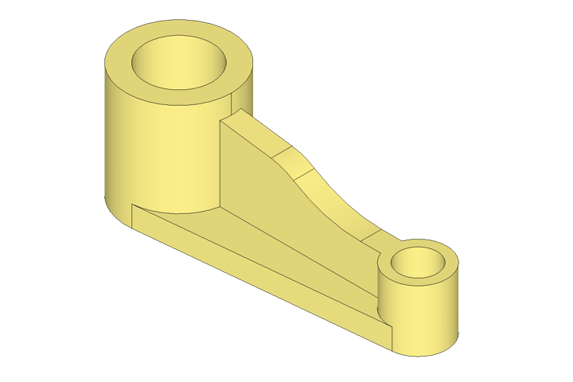

```python
r1, r2 = 55/2, 30/2

l = build_line(Plane.XZ).append(
    op_arc(30, 90-8, center=(77-r1, 0)),
    op_line(until=XX(r1)),
    op_move(end=YY(50)),
    op_extend(end=5, reverse=True),
    op_trim(Axis.X.offset((125, 32)), add=True),
    op_fillet(66),
    op_close(Axis.X),
)

p1 = l.extrude(11/2, both=True)

c1, c2 = Circle(r1), X(125) * Circle(r2)
p2 = extrude(make_hull((c1 + c2).edges()), 11)

cl1, cl2 = c1.cylinder(60), c2.cylinder(32)
part = p1 + p2 + cl1 - cl1.new(d=35) + cl2 - cl2.new(d=20)


```

