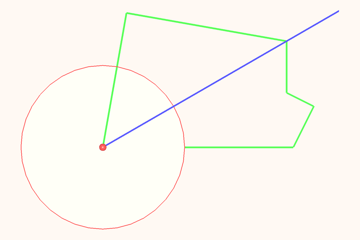

# `build_line` tutorial

## Motivation

Build123d provides a wide set of primitives to sketch planar shapes. But it's
not very convenient for composing complex wires consisting of lines, arcs and
fillets:

* You should constantly track previous end point/tangent and pass it to a next
  edge segment.
* Trimming even for trivial cases is low level.
* There is `FilletPolyline` but it could fillet only straight lines, no easy
  way to make a fillet between line and arc.
* Hard to use as geometry calculation tool to derive tricky dimensions.

## Concepts

`build_line` is a tool to draft planar (mostly, there is no actual limitation)
wire (1D) shapes which could be used to create faces (2D) and make eventually 3D parts.

It operates on chosen plane and coordinates are specified as local to plane.

Main API is `build_line.append` function which takes a sequence of "operations"
like "next point", "arc", "a line piece", "fillet previous vertex" and so on.

Operations add corresponding shapes into a build_line and one could get
a `Wire` or `Face` at any moment. Also there is a shortcut methods to make extrudes,
revolves and sweeps.

Each operation works with last shape's end point and tangent (by default)
to create a next shape. For example arc would be smoothly continued from
a line segment. Initial point and tangent are plane's origin and `x_dir`.

Operations could take a common `name` parameter to label shapes in build_line.
One could refer to labels to obtain important geometric features, like arc centers,
start/end points or tangents.

For the rest of the tutorial it uses following terms:

* **bline**: to refer to `build_line` instance
* **line**: a line segment of **bline**, straight line between two points.

## Basic workflow

* Create a `build_line` instance in needed plane (XY by default):

    ```python
    l = build_line(Plane.XZ)
    ```

* Add shapes:

    ```python
    l.append(X(10), Y(10), op_close(Axis.Y))  # a 10x10 square
    ```

* Use `build_line` instance to create Build123d shapes.

    ```python
    wire = l.wire()
    face = l.face()
    cube = l.extrude(10)  # a 10x10x10 cube
    ```

## Simple lines and coordinates

Simplest operation for `build_line.append` is specifying a line's next point.

A point could be one of:

* `Vector`: an absolute point in world (relative to bline's plane) coordinates.
* tuple: an absolute point in local to bline's plane coordinates.
* `Pos` (`X`, `Y`): a relative translation from bline's end point.
* `PPos` (partial pos, `XX`, `YY`): a mixed point, specified coordinates are absolute in
  local coordinates and rest are filled with bline's end point coordinates. It's
  hard to explain, it would be clear in examples later.

I know that world/local coordinates separation via point types is quite controversial.
But it's basically a compromise between following requirements:

1. Operations must work with local coordinates (manually defined). Any other
   approach effectively makes things vastly hard for rotated or inverted planes.
2. bline's shapes should have final world coordinates. bline is a nice tool
   to make construction lines and geometry features like arc centers or middle
   of a line segment should be accessible directly without coordinate transformations.
3. It should be easy to use point references from other model parts (in world
   coordinates) in bline's operations.

It seems (1) and (3) are in conflict with each other. However manual coordinates
rarely are specified with `Vector(...)` notation (to long to type) and location coordinates from
Build123d's shapes almost always are `Vector` instances.

Here all coordinates in action:

```python
l = build_line().append(  # Use Plane.XY by default, initial point (0, 0)
    X(10),     # line from (0, 0) to (10, 0), relative to (0, 0)
    Y(10),     # line from (10, 0) to (10, 10), `Y` is `Pos` and thus relative
    (20, 20),  # line from (10, 10) to (20, 20)
    XX(0),     # line from (20, 20) to (0, 20), x-coord is absolute and y is from last shape's end
    YY(0),     # closing line from (0, 20) to (0, 0), y-coord is absolute and x is from last shape's end
)
```


## `op_line`

```python
# 30 degrees (CCW) from Axis.X
blue = build_line().append(op_line(10, angle=30))

green = build_line().append(
    op_line(10, angle=-30, tangent=Axis.Y), # -30 degrees (CW) from Axis.Y
    op_line(angle=-135, until=blue[0]),     # -135 degress (CW) from prev line until intersection
    op_line(dir=Axis.Y, until=YY(1)),       # explicit direction until line at point (0, 1) parallel to Axis.X
)
```


