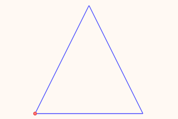
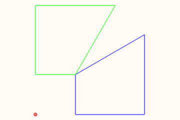
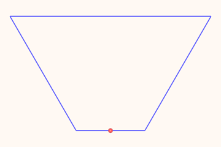
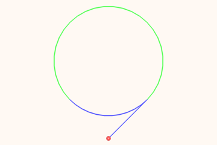
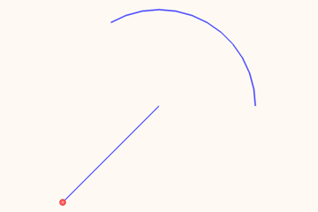
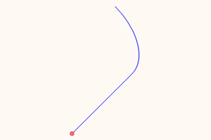
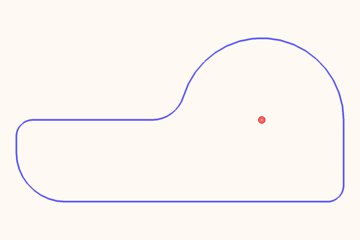
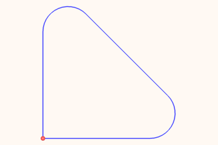
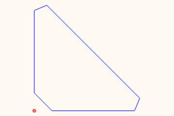

# `build_line` tutorial

## Motivation

Build123d provides a wide set of primitives to sketch planar shapes. But it's
not very convenient for composing complex wires consisting of lines, arcs and
fillets:

* You should constantly track previous end point/tangent and pass it to a next
  edge segment.
* Trimming even for trivial cases is low level.
* There is `FilletPolyline` but it could fillet only straight lines, no easy
  way to make a fillet between line and arc.
* Hard to use as geometry calculation tool to derive tricky dimensions.

## Concepts

`build_line` is a tool to draft planar (mostly, there is no actual limitation)
wire (1D) shapes which could be used to create faces (2D) and make eventually 3D parts.

It operates on chosen plane and coordinates are specified as local to plane.

Main API is `build_line.append` function which takes a sequence of "operations"
like "next point", "arc", "a line piece", "fillet previous vertex" and so on.

Operations add corresponding shapes into a build_line and one could get
a `Wire` or `Face` at any moment. Also there is a shortcut methods to make extrudes,
revolves and sweeps.

Each operation works with last shape's end point and tangent (by default)
to create a next shape. For example arc would be smoothly continued from
a line segment. Initial point and tangent are plane's origin and `x_dir`.

Type of operations:

* Vector-like: adds a line segment from a previous point.
* A Shape: adds shape as is.
* `op_*`: special `build_line` functions which abstract many useful cases.

One could access individual shapes by index: `l[0]`. Or by a name `l.name`
which could be passed to corresponding operation. It could help to obtain
important geometric features, like arc centers, start/end points or tangents.

For the rest of the tutorial it uses following terms:

* **bline**: to refer to `build_line` instance
* **line**: a line segment of **bline**, straight line between two points.

## Basic workflow

* Create a `build_line` instance in needed plane (XY by default):

    ```python
    l = build_line(Plane.XZ)
    ```

* Add shapes:

    ```python
    l.append(X(10), Y(10), op_close(Axis.Y))  # a 10x10 square
    ```

* Use `build_line` instance to create Build123d shapes.

    ```python
    wire = l.wire()
    face = l.face()
    cube = l.extrude(10)  # a 10x10x10 cube
    ```

## Simple lines and coordinates

Simplest operation for `build_line.append` is specifying a line's next point.

A point could be one of:

* `Vector`: an absolute point in world (relative to bline's plane) coordinates.
* tuple: an absolute point in local to bline's plane coordinates.
* `Pos` (`X`, `Y`): a relative translation from bline's end point.
* `PPos` (partial pos, `XX`, `YY`): a mixed point, specified coordinates are absolute in
  local coordinates and rest are filled with bline's end point coordinates. It's
  hard to explain, it would be clear in examples later.

I know that world/local coordinates separation via point types is quite controversial.
But it's basically a compromise between following requirements:

1. Operations must work with local coordinates (manually defined). Any other
   approach effectively makes things vastly hard for rotated or inverted planes.
2. bline's shapes should have final world coordinates. bline is a nice tool
   to make construction lines and geometry features like arc centers or middle
   of a line segment should be accessible directly without coordinate transformations.
3. It should be easy to use point references from other model parts (in world
   coordinates) in bline's operations.

It seems (1) and (3) are in conflict with each other. However manual coordinates
rarely are specified with `Vector(...)` notation (to long to type) and location coordinates from
Build123d's shapes almost always are `Vector` instances.

**NOTE**: Origin point `(0, 0, 0)` is marked by a fat red dot.

Here all coordinates in action:

```python
l = build_line(Plane.XZ).append(
    (20, 5),  # line to (20, 5) from initial (0, 0)
    Y(10),    # line to (20, 15), relative to previous point
    X(-10),   # line to (10, 15), relative to previous point
    YY(5),    # line to (10, 5), mixed (prev.x, 5)
    Vector(5, 0, 15), # line to (5, 15), specified in world coordinates
    XX(0),    # line to (0, 15), mixed (0, prev.y)
    YY(0),    # close bline with (0, 0), mixed (prev.x, 0)
)
```


Please take note bline is placed in XZ plane, but coordinates are
conveniently 2D in XY.

## Operations

### op_line

Allows to add a line when end point is unknown by specifying a direction
and a length constraint.

Direction:

* `dir`: an explicit vector-like direction.
* `angle`: an angle to a `tangent`, tangent by default is a tangent in a previous
  point.
* `to`: a direction towards some point.

Length:

* `length`: an explicit length.
* `until`: line's length would be limited by intersection with another shape or axis.
  Axis also could be specified with `X`, `Y`, `XX`, `YY` shortcuts. `X` and `XX`
  means an axis through a point defined by `X` or `XX` parallel to `Axis.Y` and
  vice versa for `Y` and `YY`.

```python
# 30 degrees (CCW) from Axis.X with length 10
blue = build_line().append(op_line(10, angle=30))

# some construction shape
red = Circle(3)

green = build_line().append(
    # -10 degrees (CW) from Axis.Y with length 5
    op_line(5, angle=-10, tangent=Axis.Y),

    # -90 degress (CW) from prev line until intersection
    op_line(angle=-90, until=blue[0]),

    # explicit direction until line at point (0, 2) parallel to Axis.X
    op_line(dir=Axis.Y, until=YY(2)),

    # until intersection with line at relative point (end + (1, 0)) parallel to Axis.Y
    # `dir` could be a vector like
    op_line(dir=(1, -0.5), until=X(1)),

    # until could be an axis as well
    op_line(angle=-90, until=Axis.X),

    # direction towards a point, until intersection with another shape
    op_line(to=(0, 0), until=red),
)
```


### op_start

`build_line` assumes plane's origin as a start point but it could be highly
inconvenient to move a plane to a needed coordinate. `op_start` allows to
set initial start point and tangent.

```python
l = build_line().append(
    op_start(X(10*math.cos(30*dpr)), tangent=Axis.Y),
    op_line(10, angle=60),
    op_line(10, angle=60),
    op_line(10, angle=120),
    op_line(10, angle=60),
)
```


### op_close

`op_close` allows to close a line or close a line with a projection.

```python
l = build_line().append(
    X(10), (5, 10),
    op_close(),  # closes bline to the initial (0, 0) point
)
```



Often it's needed to close a shape by projecting end points to some axis:

```python
blue = build_line().append(
    op_line(10, start=(5, 5), angle=30),
    op_close(Axis.X),
)

green = build_line().append(
    op_line(10, start=(5, 5), angle=60),
    op_close(Axis.Y),
)
```



Also `op_close` could close a shape over a mirror axis:

```python
l = build_line().append(
    op_line(start=(3, 0), angle=60, until=YY(10)),
    op_close(mirror=Axis.Y),
)
```




### op_arc / op_ellipse_arc

A unified arc builder.

`JernArc`, an arc defined by start/tangent point, radius and arc size:

```python
l = build_line(Plane.XZ).append(
    (5, 5),
    op_arc(radius=5, size=180),
)
```


`TangentArc`, an arc defined by start/tangent and end points:

```python
l = build_line(Plane.XZ).append(
    (5, 5),
    op_arc(to=X(-10)),
)
```


`RadiusArc`, an arc defined by start and end points and radius:

```python
# tangent should be explicitly set to False to trigger radius arc
blue = build_line(Plane.XZ).append(
    (5, 5),
    op_arc(radius=7, to=X(-10), tangent=False),
)

# `short` parameter could be used to control which arc to select
green = build_line(Plane.XZ).append(
    op_arc(radius=7, start=(5, 5), to=X(-10), tangent=False, short=False)
)
```



`CenterArc`, an arc defined by center point, radius and arc start and end
angles:

```python
l = build_line(Plane.XZ).append(
    (5, 5),
    op_arc(radius=5, size=120, center=True),
)
```



Ellipse arcs:

```python
l = build_line(Plane.XZ).append(
    (5, 5),
    op_ellipse_arc(r1=5, r2=3, size=90),
)
```



### op_fillet / op_chamfer

Allows to make a fillet/chamfer for last `N` (default is 1) added vertices in a bline:

```python
l = build_line().append(
    op_arc(radius=5, size=180, center=True),
    X(-10), op_fillet(2),
    Y(-5), op_fillet(1),
    XX(5), op_fillet(3),
    op_close(), op_fillet(1),
)
```



Note: `op_fillet` naturally merges adjacent shapes into one.

A fillet for multiple vertices:

```python
l = build_line().append(
    X(20), (0, 20), op_close(),
    op_fillet(3, count=2)
)
```



To work with closing point there is `closed=True` parameter:

```python
l = build_line().append(
    X(20), (0, 20), op_close(),
    op_chamfer(3, count=3, closed=True)
)
```


